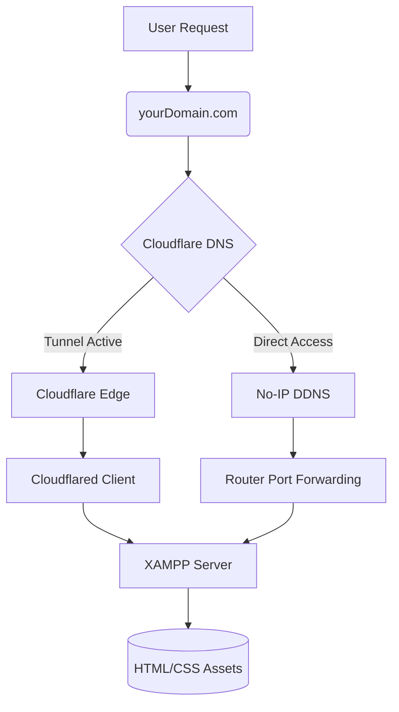

# Home Server Hosting Solution with Cloudflare Tunnel


A robust multi-layered infrastructure for hosting static websites from a home Linux server, overcoming ISP limitations through Cloudflare Tunnel integration.

## Table of Contents
- [Project Overview](#project-overview)
- [Key Components](#key-components)
- [Local Server Setup](#local-server-setup)
- [Dynamic DNS (No-IP) Setup](#dynamic-dns-no-ip-setup)
- [External Access & Security](#external-access--security)
- [Security Layers](#security-layers)
- [Data Flow](#data-flow)
- [Installation](#installation)
- [Challenges & Solutions](#challenges--solutions)
- [FAQ](#faq)
- [License](#license)

## Project Overview
This project enables secure external access to a home-hosted static website through:
- XAMPP/Apache web server
- No-IP Dynamic DNS
- Cloudflare Tunnel (Argo Tunnel)
- Custom Domain Integration
- Systemd service management
- Prometheus Monitoring
- Grafana Visualization

**Key Features**:
- Bypasses ISP port blocking and CGNAT issues
- HTTPS termination is managed by Cloudflare with automated certificate renewal
- Persistent tunnel connection via systemd service
- Free SSL via Cloudflare
- Automatic DNS updates via Cloudflare, with a free domain: **yourDomain.com**
- Comprehensive server monitoring with Prometheus and Grafana

## Key Components

| Component       | Technology           | Role                                                  |
|-----------------|----------------------|-------------------------------------------------------|
| **Web Server**  | XAMPP (Apache)       | Hosts and serves static website files                 |
| **Dynamic DNS** | No-IP (noip2 client) | Maps your dynamic home IP to `No-ip.ddns.net`         |
| **Tunneling**   | Cloudflare Tunnel    | Bypasses ISP restrictions and CGNAT                   |
| **Security**    | Cloudflare Proxy & ufw | Encrypts traffic and filters network threats        |
| **Logging**     | Apache Logs          | Tracks server access and error logging                |
| **Monitoring**  | Prometheus & node_exporter | Collects metrics from Apache and the Linux server|
| **Visualization** | Grafana            | Provides dashboards for visualizing collected metrics |


## Local Server Setup
- **Host Machine:** A Linux PC (Ubuntu 22.04 LTS) serves as the primary host.
- **Web Server:** XAMPP (Apache) is used to serve static website files.
- **Document Root:** Files are stored in `/opt/lampp/htdocs/` (e.g., `index.html`, `styles.css`).
- **Ports:** The server listens on port 80 (HTTP) and can be configured for port 443 (HTTPS) if needed.
- **Static Content:** HTML and CSS files that represent your portfolio or project details.

## Dynamic DNS (No-IP) Setup
- **Purpose:** Ensures that your home server's dynamic IP is mapped to a consistent domain name.
- **No-IP Client:** Runs as a service (using `noip2`) on your Linux machine.
- **Configuration:** The client regularly updates No-IP servers with your current public IP, ensuring that `No-ip.ddns.net` remains accurate.
- **Fallback:** Provides an additional layer of reachability in case of tunnel issues.

## External Access & Security
- **Cloudflare Tunnel:** Bypasses ISP restrictions (port blocking, CGNAT) by routing traffic through Cloudflare's secure network.
  - **Domain Integration:** The free domain `yourDomain.com` is linked to Cloudflare, ensuring global accessibility.
  - **DNS Management:** Cloudflare's nameservers handle DNS resolution, pointing to Cloudflare's anycast IPs.
- **HTTPS Termination:** Managed entirely by Cloudflare, which automates certificate renewal for secure connections.

## Security Layers
- **Firewall:** The server uses `ufw` (Uncomplicated Firewall) to allow only essential traffic (ports 80 and 443).
- **Web Server Hardening:**
  - XAMPP's unnecessary components (e.g., MySQL/phpMyAdmin) are disabled to reduce the attack surface.
  - File permissions are set to `nobody:nogroup` to enforce least privilege.
- **Cloudflare Security:**
  - SSL/TLS encryption ensures that data in transit is secure.
  - Cloudflare rules provide additional security, such as blocking malicious traffic and DDoS protection.
-  **Enhanced Monitoring:**
  - Prometheus and Grafana provide insights into server performance and potential issues. 

## Data Flow
1. **User Request:**  
   A visitor navigates to `yourDomain.com` in their browser.
2. **DNS Resolution:**  
   Cloudflare's DNS service resolves the domain to its global anycast IP.
3. **Traffic Routing:**  
   The request is routed through Cloudflare's network and forwarded via the Cloudflare Tunnel to the home server.
4. **Server Response:**  
   XAMPP serves the requested static content (e.g., `index.html`, `styles.css`) from `/opt/lampp/htdocs/`.
5. **Content Delivery:**  
   The user’s browser renders the HTML/CSS, displaying the website.
6. **Monitoring Data Collection:**
   - `node_exporter` collects system metrics from the Linux server.
   - `prometheus-apache-exporter` attempts to collect metrics from the Apache web server's `/server-status` page.
7. **Prometheus Storage:**
    Prometheus scrapes and stores the collected metrics.
8. **Grafana Visualization:**
    Grafana queries Prometheus to display the metrics on dashboards.

### Component Interaction   

## Installation

### Prerequisites
- Cloudflare account (with automated certificate management)
- No-IP account
- Static website files
- Ubuntu 22.04 LTS
- Prometheus installed and configured
- Grafana installed and running

### Installation & Configuration

1. **XAMPP Installation**
```bash
   wget https://www.apachefriends.org/xampp-files/8.2.12/xampp-linux-x64-8.2.12-0-installer.run
   chmod +x xampp-linux-x64-8.2.12-0-installer.run
   sudo ./xampp-linux-x64-8.2.12-0-installer.run
   
  ``` 
2. **Cloudflare Tunnel Deployment**  
```bash
curl -L https://github.com/cloudflare/cloudflared/releases/latest/download/cloudflared-linux-amd64.deb -o cloudflared.deb
sudo dpkg -i cloudflared.deb
cloudflared tunnel login
cloudflared tunnel create mytunnel
```
3. **Systemd Service Configuration for Cloudflare Tunnel**
Create a systemd service file:
```bash
sudo vi /etc/systemd/system/cloudflared.service
```
Add the following content (adjust User if needed):
```ini
[Unit]
Description=Cloudflare Tunnel
After=network.target

[Service]
Type=simple
User=www-data
ExecStart=/usr/local/bin/cloudflared tunnel run mytunnel
Restart=always
RestartSec=5s

[Install]
WantedBy=multi-user.target
```
Enable and start the service:
```bash
sudo systemctl daemon-reload
sudo systemctl enable cloudflared
sudo systemctl start cloudflared
```
4. **DNS & Domain Configuration**

- Link your free domain (yourDomain.com) to Cloudflare.
- Ensure Cloudflare’s nameservers are correctly set.
- Configure the DNS records to point to your Cloudflare Tunnel.
5. **Prometheus Installation:**
Follow the official Prometheus documentation for installation.

6. **Grafana Installation:**
Follow the official Grafana documentation for installation.

7. **Install prometheus-apache-exporter:**
   ```bash
   sudo apt update
   sudo apt install prometheus-apache-exporter
   ```
8. **Install node_exporter:**
   ```bash
   sudo apt update
   sudo apt install prometheus-node-exporter
   ```
## Configuration
1. **Prometheus Configuration (```prometheus.yml```):**
   Edit your Prometheus configuration file (usually located at ```/etc/prometheus/prometheus.yml```) to add jobs for the ```apache_exporter``` and the ```node_exporter```:
   ```yaml
   scrape_configs:
    - job_name: 'apache'
    static_configs:
      - targets: ['localhost:9117']

    - job_name: 'node'
    static_configs:
      - targets: ['localhost:9100']
   ```
   - Restart the Prometheus service:
   ```bash
   sudo systemctl restart prometheus
   ```

2. **Apache Configuration (```httpd.conf``` and ```httpd-info.conf```):**

- **Enable ```mod_status```:** Uncomment LoadModule ```status_module modules/mod_status.so``` in ```/opt/lampp/etc/httpd.conf```.

- **Configure Status Page Access:** Edit ```/opt/lampp/etc/extra/httpd-info.conf```:
```apache
   <Location /server-status>
      SetHandler server-status
      Require local
   </Location>
```
- Restart Apache:
```bash
  sudo /opt/lampp/lampp restartapache
```
3. **Grafana Data Source:**
- Add Prometheus as a data source in Grafana (e.g., http://localhost:9090).

## Challenges & Solutions
1. **CSS File Loading Issue**
- Problem: Stylesheets were not applying despite correct file structure.
- Cause: A typo in the filename (e.g., style.css vs. styles.css).
- Solution:
```bash
mv /opt/lampp/htdocs/style.css /opt/lampp/htdocs/styles.css
chown www-data:www-data /opt/lampp/htdocs/styles.css
```
2. **Tunnel Persistence**
- **Problem:** The Cloudflare Tunnel disconnected when the terminal was closed.
- **Solution:** Implemented a systemd service to ensure the tunnel runs persistently.
```bash
sudo systemctl enable cloudflared
sudo systemctl start cloudflared
```
3. **DNS Configuration Challenges**

- **Issue:** Nameserver IP validation failures.
- **Resolution:** Configured DNS with Cloudflare's anycast IPs and linked the free domain (yourDomain.com) to stabilize routing.
4. **Tunnel Connection Drops**
- **Symptoms:** ERR_CONNECTION_TIMED_OUT
- **Diagnosis:**
```bash
journalctl -u cloudflared --since "5 minutes ago"
```
- **Solution:** 
- Reauthenticate tunnel: ```cloudflared tunnel login```
- Verify DNS records
5. **DNS Propagation Issues**
- **Verification:**
```bash
dig yourDomain.com +short
nslookup no-ipdns.ddns.net
```
6. **Apache ```mod_status``` Configuration:**
- **Issue:** Initially, the ```/server-status``` page was not accessible, resulting in the apache_exporter reporting the Apache server as down.
- **Solutions Attempted:**
- Ensured ```LoadModule status_module``` as uncommented in ```httpd.conf```.
- Configured the ```<Location /server-status>``` block in ```httpd-info.conf``` with Require local and specific IP addresses.
- Encountered "403 Forbidden" errors, indicating permission issues.
- Encountered "Syntax error" related to ```mod_foo.so in httpd.conf``` (resolved by commenting out the line).
- Encountered "Syntax error" related to mod_status in ```httpd-info.conf``` (resolved by moving the ```LoadModule``` directive in ```httpd.conf```).
- Current Status: While Prometheus is now scraping some metrics from the ```apache_exporter```, the ```apache_up``` metric is still reporting 0, suggesting the exporter cannot reliably access the ```/server-status``` page. Further investigation into Apache's access permissions might be needed.

**Current Status:** While Prometheus is now scraping some metrics from the ```apache_exporter```, the apache_up metric is still reporting 0, suggesting the exporter cannot reliably access the ```/server-status``` page. Further investigation into Apache's access permissions might be needed.


## Security Implementation
### Defense-in-Depth Strategy
1. **Network Layer**
- UFW firewall with default deny policy
- Cloudflare DDoS protection
2. **Application Layer**
- XAMPP hardening:
```bash
sudo /opt/lampp/lampp stopmysql
sudo rm -rf /opt/lampp/phpmyadmin
```
3. **Data Layer**
- File ownership: nobody:nogroup
- Strict permissions (755/644)
4. **Transport Layer**
- Cloudflare SSL/TLS encryption
- Automatic HTTPS redirects

## Future Improvements
- **HTTPS Setup:** Integrate Let’s Encrypt with Certbot for native SSL on Apache.
- **Named Cloudflare Tunnel:** Transition from a trial tunnel to a custom domain setup for improved reliability.
- **Docker Migration:** Explore containerization (e.g., using httpd:alpine) once hardware supports KVM or similar technology.
- **Enhanced Monitoring:**
   - Implement uptime monitoring (e.g. Uptime Robot).
   - Further troubleshoot and resolve the apache_exporter issue to gain insights into Apache performance.
   - Explore setting up alerts in Prometheus and Grafana for critical metrics.
   - Consider monitoring other aspects of the XAMPP stack (e.g., PHP-FPM if used).

## FAQ
**Q: How do I rename an existing tunnel?**
**A:** Tunnels cannot be renamed. To change the name, create a new tunnel, update your DNS records, and delete the old tunnel.

**Q: How do I ensure the tunnel survives reboots?**
**A:** The systemd service configuration ensures that the tunnel starts automatically on boot:
```bash
sudo systemctl enable cloudflared
```
**Q: Why use both No-IP and Cloudflare?**
**A:**

**No-IP:** Provides a fallback for dynamic DNS updates.
**Cloudflare Tunnel:** Bypasses ISP restrictions (port blocking/CGNAT) and handles HTTPS termination with automated certificate renewal.

**Q: How to monitor traffic?**
```bash
sudo tail -f /opt/lampp/logs/access_log
```
**Q: How do I access Prometheus?**
- You can usually access the Prometheus web UI at ```http://your_server_ip:9090``` or ```http://localhost:9090``` if you are on the server.
**Q: How do I access Grafana?**
- Grafana typically runs on port 3000. You can access it in your web browser at http://your_server_ip:3000 or http://localhost:3000.
  
## License
MIT License - See [LICENSE](/LICENSE) for details.

- **Author:** Anamelechi Philip Njoku
- **Contact:** philznjoku@gmail.com
- **Live Demo:** https://anamelechi.com
